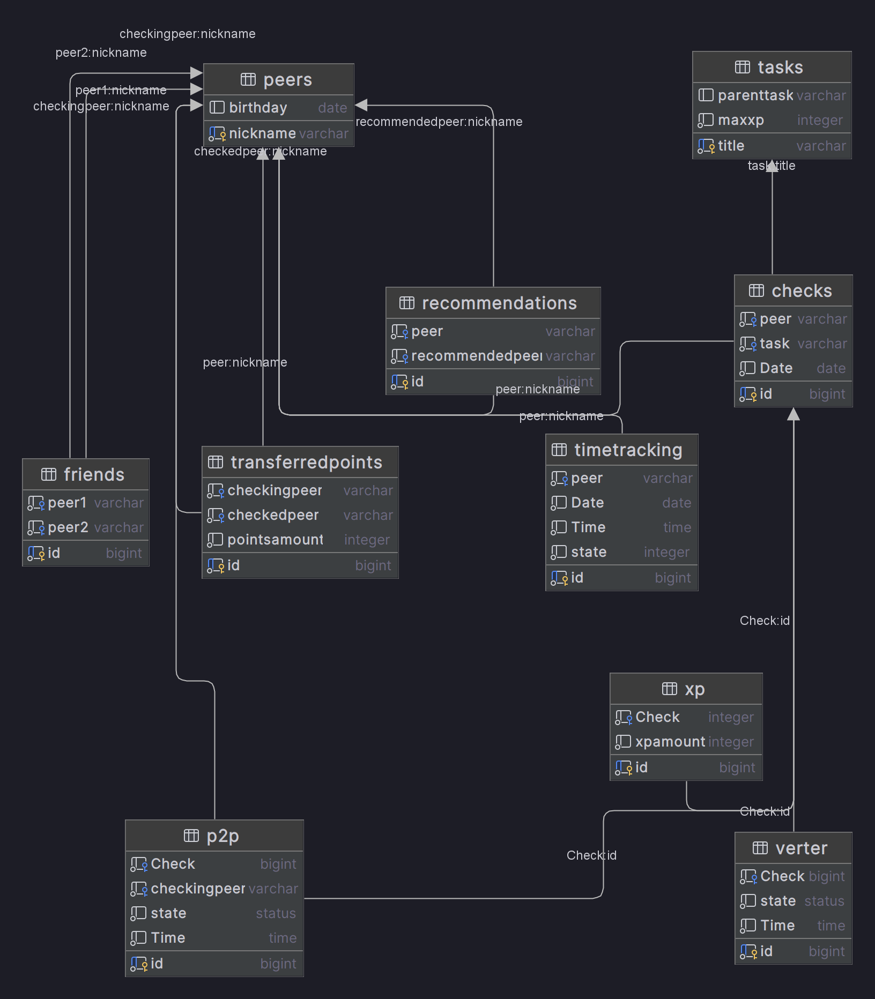

# Info21 v1.0 - Data Analysis and Statistics for School 21

## Overview
Info21 v1.0 project involves creating a database with data about School 21 and writing procedures and functions to retrieve information, as well as procedures and triggers to change it.

## Logical View of the Database
The logical view of the database for the Info21 v1.0 project represents the organization and relationship of the data within the database. Here's a brief overview:

1. **Peers table**: Stores information about the peers.
2. **Tasks table**: Stores information about the tasks.
3. **Check status**: Enumeration type that defines the possible states of a check.
4. **P2P Table**: Records the details of the peer-to-peer (P2P) checks.
5. **Verter Table**: Records the details of the checks conducted by Verter.
6. **Checks table**: Records the details of the checks conducted on the tasks.
7. **TransferredPoints table**: Records the details of the peer points transferred during P2P checks.
8. **Friends table**: Records the details of the friendships among the peers.
9. **Recommendations table**: Records the details of the recommendations made by the peers.
10. **XP Table**: Records the details of the XP earned by the peers.
11. **TimeTracking table**: Records the details of the peers' visits to campus.

## Tasks

### Task 1: Database Creation
- **`part1.sql`** Script that creates the database and all the tables described 
  in the 
  logical view of the database.

### Task 2: Changing Data
- **`part2.sql`** Script that includes procedures for adding P2P check, 
  adding checking by Verter, and triggers for changing records in the P2P and XP tables.

### Task 3: Getting Data
- **`part3.sql`** Script that includes functions for returning the 
  TransferredPoints table in a more human-readable form, returning a table of the form: username, name of the checked task, number of XP received, finding the peers who have not left campus for the whole day, calculating the change in the number of peer points of each peer using the TransferredPoints table, and more.

### Task 4: Metadata
- **`part4.sql`**  Creates a separate database for testing the procedures. 
  Creates stored procedures for destroying tables in the current database, 
  outputting a list of names and parameters of all scalar user's SQL functions in the current database, destroying all SQL DML triggers in the current database, and outputting names and descriptions of object types that have a string specified by the procedure parameter.